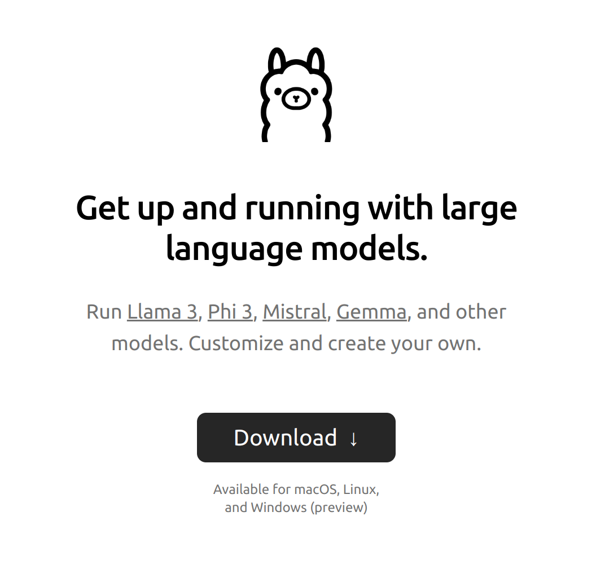
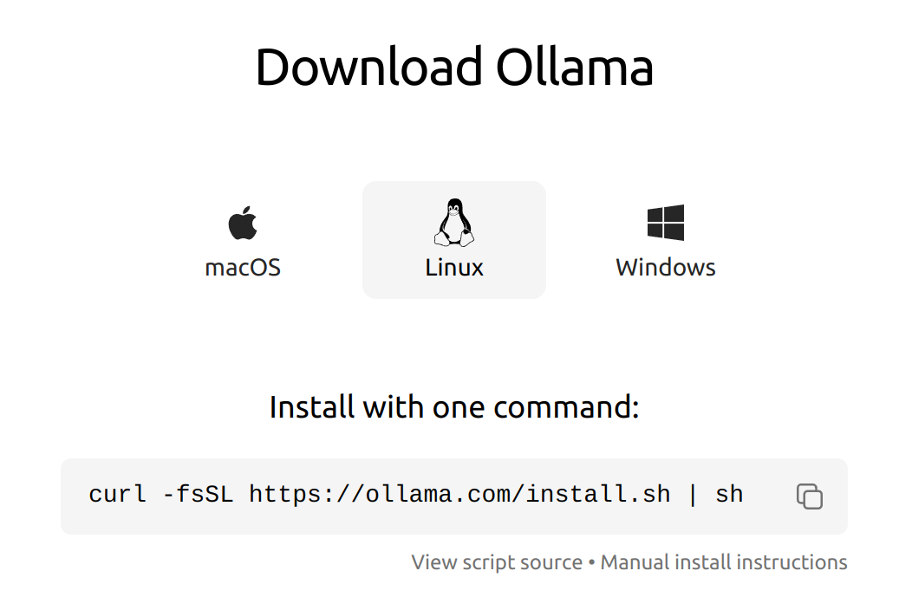
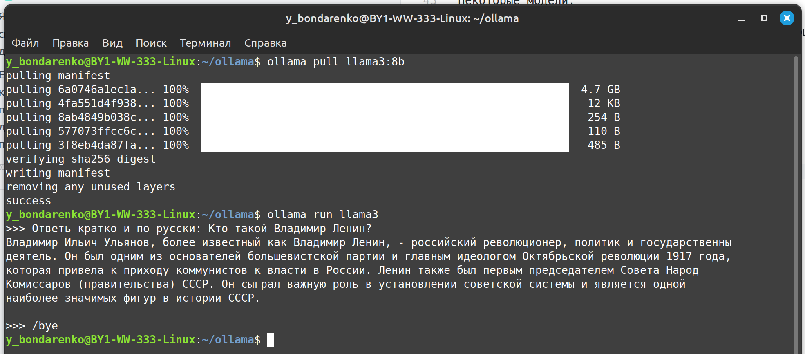
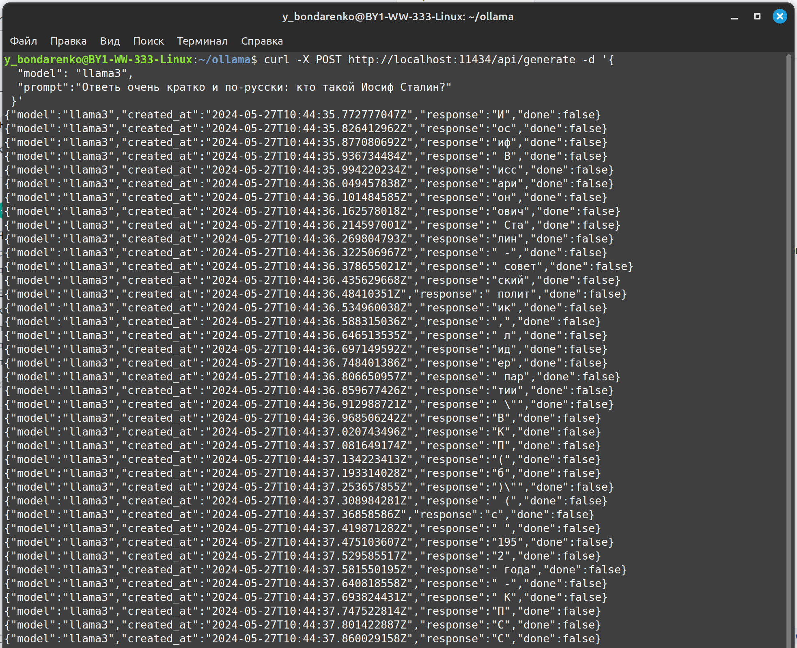
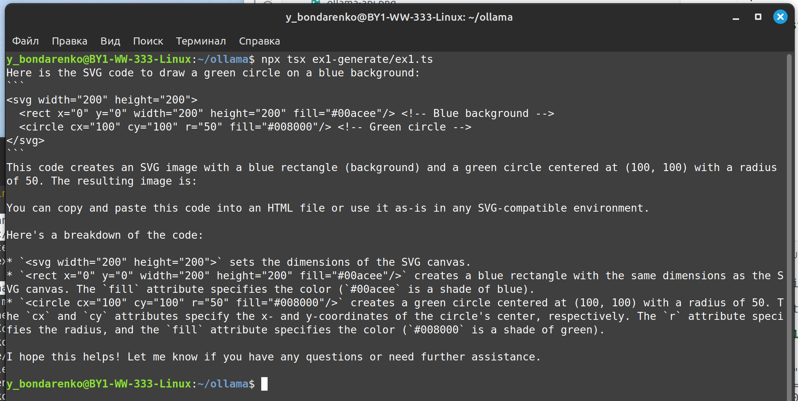
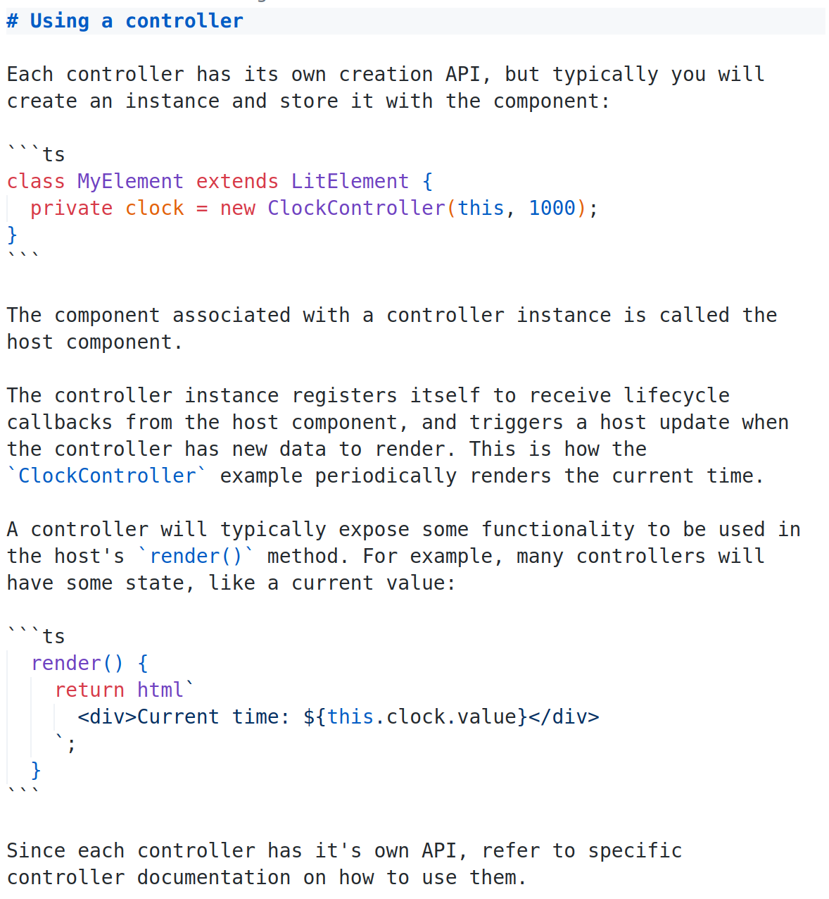
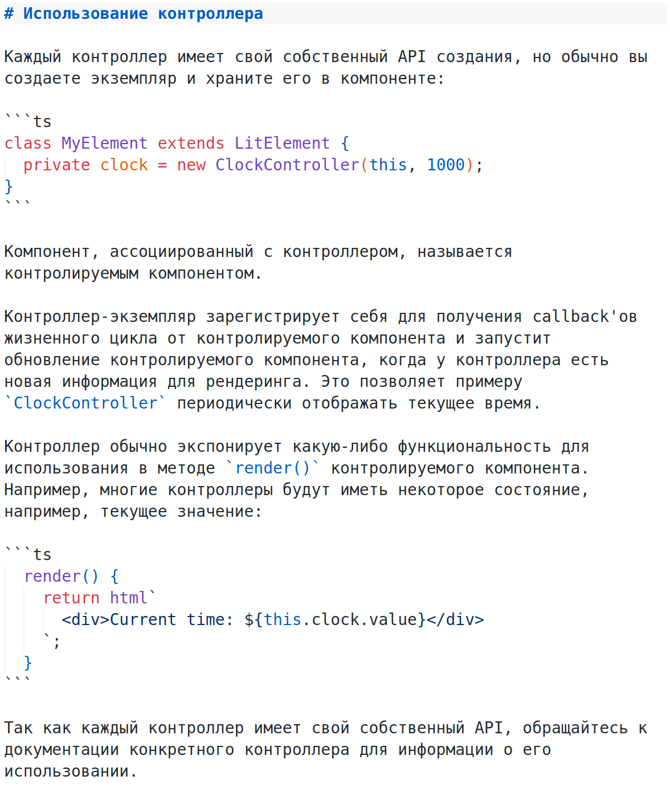
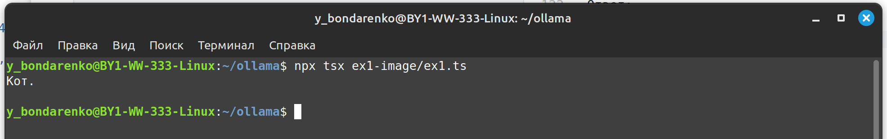
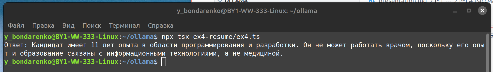
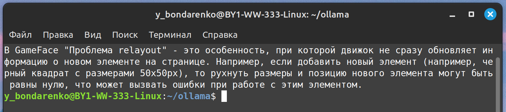

# Локальные GPT для фронтендера

Практические кейсы использования локальных больших языковых моделей

---



# Ollama

- [ollama.com](https://ollama.com/)
- [Исходники ollama](https://github.com/ollama/ollama)
- [JS API](https://github.com/ollama/ollama-js)

---



# Установка Ollama

- [ollama.com/download](https://ollama.com/download)

Linux:

```sh
curl -fsSL https://ollama.com/install.sh | sh
```

[Дока по ручной установке](https://github.com/ollama/ollama/blob/main/docs/linux.md)

Доступны также версии для винды и мака.

---

# Где брать языковые модели

- [Библиотека моделей](https://ollama.com/library)

Некоторые модели:

- [llama3](https://ollama.com/library/llama3) - общая языковая модель
- [llava](https://ollama.com/library/llava) - рассматривает и описывает картинки

---

# Чятик



Скачиваем модельку себе на комп:

```sh
ollama pull llama3:8b
```

Запускаем чат с моделью llama3:

```sh
ollama run llama3
```

---

# Апи



```sh
curl -X POST http://localhost:11434/api/generate -d '{
  "model": "llama3",
  "prompt":"Ответь очень кратко и по-русски: кто такой Иосиф Сталин?"
 }'
```

---

# Либа для работы с Ollama

- [ollama-js](https://github.com/ollama/ollama-js)

---

# Генерация



Попросим модель сгенерировать нам SVG картинку:

```ts
import { Ollama } from "ollama";

const ollama = new Ollama({ host: "http://localhost:11434" });

const response = await ollama.generate({
  model: "llama3",
  prompt: "draw a green circle on a blue background in svg format",
  stream: true,
});
for await (const part of response) {
  process.stdout.write(part.response);
}
process.stdout.write("\n\n");
```

---

# Результат


---

# Переводчик

Настроим нашу модель и попросим ее перевести документацию:

```ts
import ollama from "ollama";
import fs from "fs";

const modelfile = `
FROM llama3
PARAMETER temperature 0
SYSTEM """
You are a translator of technical documentation from English 
into Russian. Variable names in single quotes do not need 
to be translated, source code in triple quotes does not need 
to be translated."
`;
await ollama.create({ model: "translator", modelfile: modelfile });

const docPath = "./ex2-translate/doc.md";
const docAsBase64 = fs.readFileSync(docPath, "utf8");

const response = await ollama.generate({
  model: "llama3",
  prompt: "Переведи эту документацию на русский язык: " + docAsBase64,
  stream: true,
});
for await (const part of response) {
  process.stdout.write(part.response);
}
```

---

Результат:




---

# Картинки


Спрашиваем, что на картинке:

```ts
import { Ollama } from "ollama";
import fs from "fs";

const imagePath = "./ex3-image/cat2.jpg";
const imageAsBase64 = fs.readFileSync(imagePath, "base64");

const ollama = new Ollama({ host: "http://localhost:11434" });

const response = await ollama.generate({
  model: "llama3",
  prompt:
    "Ответь одним словом и по русски, какое животное на этой base64 картинке: " +
    imageAsBase64,
  stream: true,
});
for await (const part of response) {
  process.stdout.write(part.response);
}
process.stdout.write("\n\n");
```

Ответ:



---

# LlamaIndex

Фреймворк для работы с моделями.

- [llamaindex.ai](https://www.llamaindex.ai/)
- [TS дока](https://ts.llamaindex.ai/)

по умолчанию работает с OpenAI и просит API-ключ

---

# Анализ



Берем резюме кандидата, и анализируем:

```ts
import {
  Document,
  HuggingFaceEmbedding,
  Ollama,
  Settings,
  VectorStoreIndex,
} from "llamaindex";
import fs from "node:fs";

Settings.llm = new Ollama({
  model: "llama3",
});

Settings.embedModel = new HuggingFaceEmbedding({
  modelType: "BAAI/bge-small-en-v1.5",
  quantized: false,
});

async function main() {
  // Load essay from abramov.txt in Node
  const path = "./ex4-resume/profile.txt";

  const essay = fs.readFileSync(path, "utf-8");

  // Create Document object with essay
  const document = new Document({ text: essay, id_: path });

  // Split text and create embeddings. Store them in a VectorStoreIndex
  const index = await VectorStoreIndex.fromDocuments([document]);

  // Query the index
  const queryEngine = index.asQueryEngine();

  const response = await queryEngine.query({
    query:
      "Ответь по русски и кратко, сколько лет опыта у кандидата и сможет ли он работать врачом?",
  });

  // Output response
  console.log(response.toString());
}

main().catch(console.error);
```

---

# Поиск по докам



```ts
import {
  Document,
  HuggingFaceEmbedding,
  Ollama,
  Settings,
  VectorStoreIndex,
} from "llamaindex";
import fs from "node:fs";
import path from "node:path";

Settings.llm = new Ollama({
  model: "llama3",
});

Settings.embedModel = new HuggingFaceEmbedding({
  modelType: "BAAI/bge-small-en-v1.5",
  quantized: false,
});

function readFilesInDirectory(directoryPath) {
  const files = fs.readdirSync(directoryPath);
  const fileContents = [];

  for (const file of files) {
    const filePath = path.join(directoryPath, file);
    const fileContent = fs.readFileSync(filePath, "utf-8");
    fileContents.push(fileContent);
  }

  return fileContents;
}

async function main() {
  // Load essay from abramov.txt in Node
  // const path = "./ex4-resume/profile.txt";

  // const essay = fs.readFileSync(path, "utf-8");
  const fileContents = readFilesInDirectory("./ex5-search/data");

  // Create Document object with essay
  // const document = new Document({ text: essay, id_: path });
  const documents = fileContents.map((file, i) => {
    return new Document({ text: file, id_: `${i}` });
  });

  // Split text and create embeddings. Store them in a VectorStoreIndex
  const index = await VectorStoreIndex.fromDocuments(documents);

  // Query the index
  const queryEngine = index.asQueryEngine();

  const response = await queryEngine.query({
    query: "Ответь по русски и кратко: Что такое Проблема relayout в Gameface",
  });

  // Output response
  console.log(response.toString());
  // console.log(JSON.stringify(response, null, 2));
}

main().catch(console.error);
```
